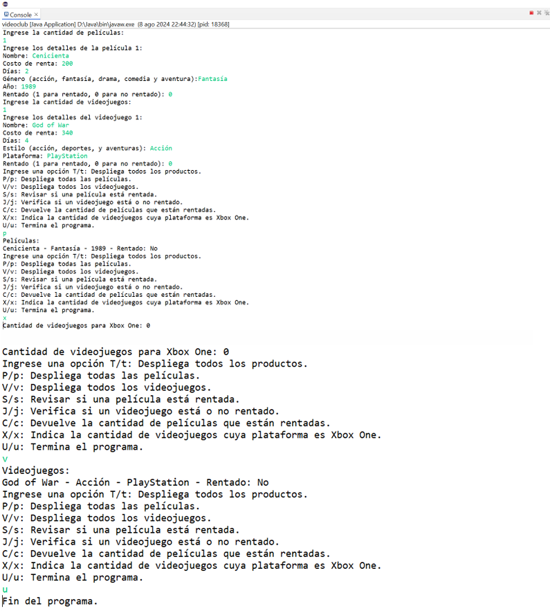

# Sistema_Videoclub
Este programa es el sistema de un Videoclub el cual almacena información sobre sus productos y genera compras "rentas"

## Planteamiento de la problemática del caso para el programa desarrollado

### Videoclub Games & Videos
El dueño de un videoclub sabe de ti a través de una red de networking, te contacta y te informa que le interesa contratar tus servicios profesionales, pues te comenta que tiene un problema: necesita mejorar la administración de su negocio, contar con la elaboración de una aplicación para administrar las rentas de los dos tipos de productos que maneja; videojuegos y películas.

Para todos los productos se tiene la siguiente información: nombre del producto, la cantidad a pagar por rentar ese producto, cantidad de días que se presta al momento de rentar y si en ese momento el producto está o no disponible.

Para cada una de las películas se tiene el género (acción, fantasía, drama, comedia y aventura) y el año de producción.

Para los juegos se cuenta con el estilo (acción, deportes y aventuras) y la plataforma (Xbox, PlayStation, Wii) en la que se puede ejecutar.

### Instrucciones para la aplicación 
Desarrolla una aplicación que permita realizar consultas y administrar las rentas de los productos como se describe más adelante:

+ Realiza el diagrama de clase de acuerdo a la descripción anterior. Debe incluir el nombre de la clase y las variables de instancia tanto de la clase base como de las clases derivadas.
+ Construye la clase base y las clases derivadas las cuales deben incluir el constructor y los métodos get y set para cada una de las variables de instancia.
+ Construye una aplicación que emplee las clases que elaboraste en el punto anterior y que realice lo siguiente:
+ Leer la cantidad de películas que proporcionará el usuario y posteriormente leer la información de cada una de ellas:
**nombre, costoRenta, días, género, año, rentado**

+ Leer la cantidad de videojuegos que proporcionará el usuario y posteriormente leer la información de cada uno de ellos:
**nombre, costoRenta, días, estilo, plataforma, rentado**

**Nota:** el campo rentado se refiere a si el producto está o no rentado (1 está rentado, 0 no está rentado).

+ Permanecer en un ciclo ejecutando la acción solicitada por el usuario. La acción se solicita a través de algunos de los siguientes comandos:
+ **T/t:** Despliega todos los productos.
+ **P/p:** Despliega todas las películas.
+ **V/v:** Despliega todos los videojuegos.
+ **S/s:** Checar si una película está rentada.
+ **J/j:** Verifica si un videojuego está o no rentado.
+ **C/c:** Devuelve la cantidad de películas que están rentadas.
+ **X/x:** Indica la cantidad de videojuegos cuya plataforma es Xbox One.
+ **U/u:** Termina el programa.

## Tecnologías que se utilizaron: 
**JAVA**

### El programa mostrará una pantalla similar al ser compilado: 

